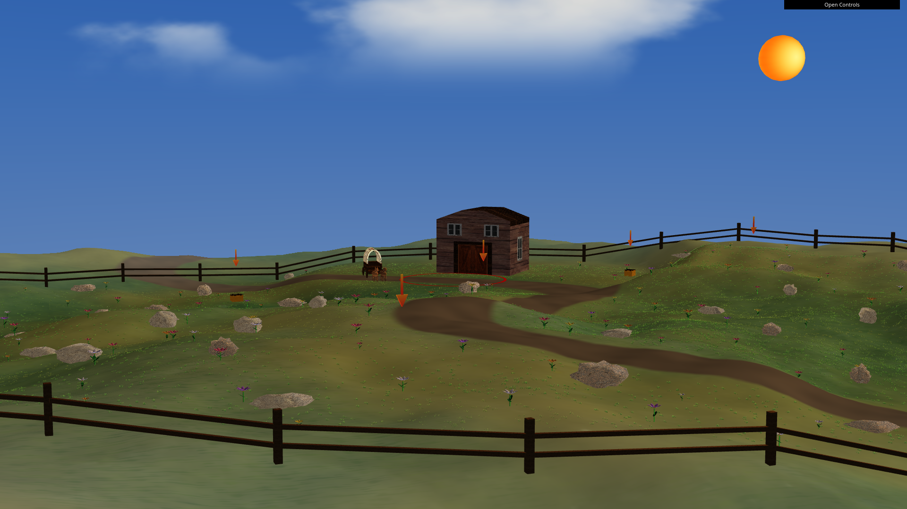
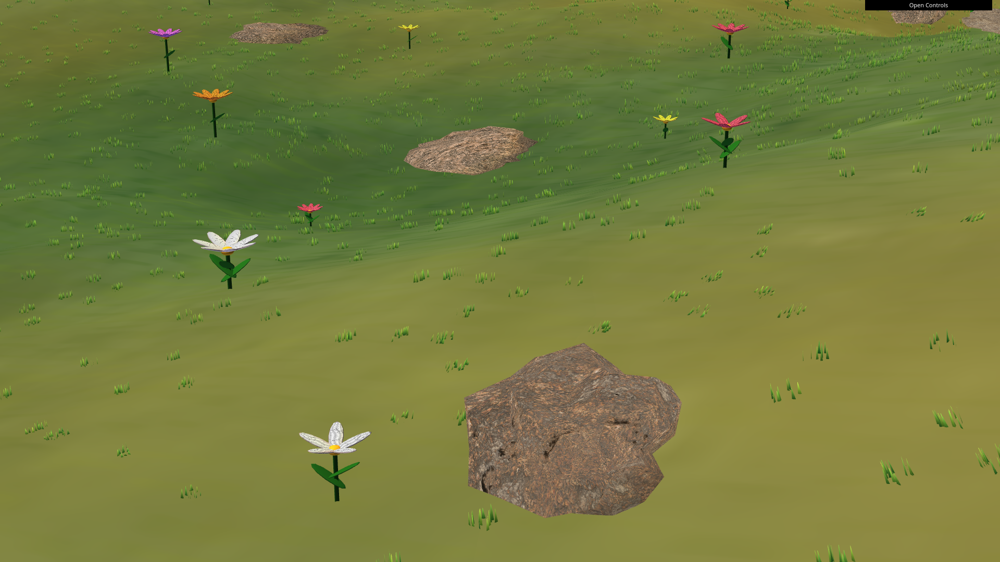
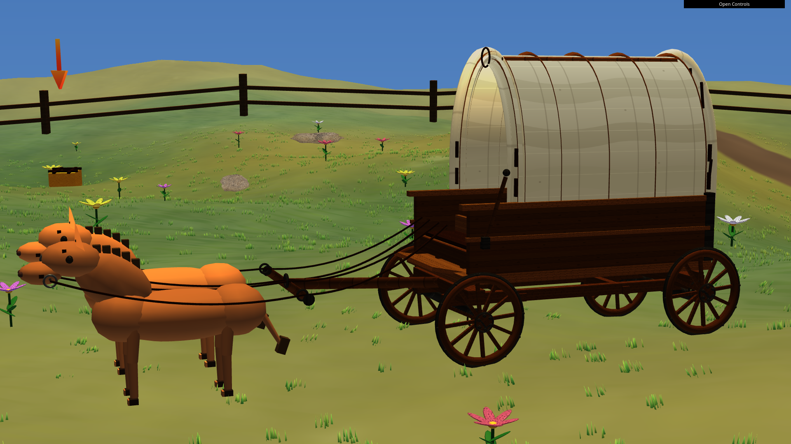
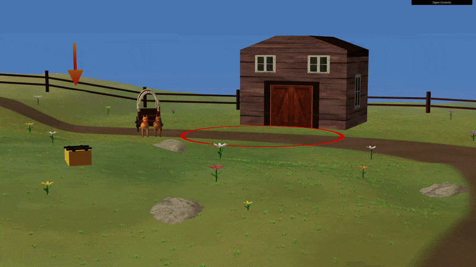
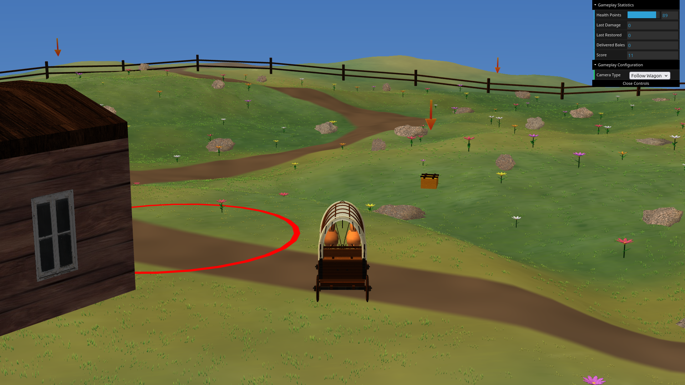

# CG 2025/2026

## Group T11G03

## Final Project - Gamified Spring Prairie Landscape

### Introduction

<!-- Project introduction and context -->

This project was developed for the L.EIC027 Computer Graphics curricular unit of the Bachelor in Informatics and Computer Engineering at FEUP, during the 2025/2026 academic year.

The goal of this project is to build an interactive 3D scene using WebCGF, applying geometric modelling, hierarchical transformations, illumination, materials, textures, shaders, real-time user interaction, and animation, along with practicing cooperative software development.

### Scene Description and Features

<!-- Brief description of the scene and features implemented -->

Our scene is a spring prairie survival game where the player controls a covered light wagon and tries to survive for as long as possible. The wagon must collect hay bales scattered across the terrain and deliver them to the barn to recover health, while avoiding rocks and solid obstacles such as the barn and fence. Health points decrease over time, and the final score corresponds to the number of seconds survived.

The environment includes a large sky dome, an animated sun, procedural moving clouds, and procedurally generated terrain with rolling hills. The terrain also contains a wagon pathway, grass patches, flowers, rocks, and a boundary fence that delimits the playable area.

The main interactive entity is a hierarchical prairie schooner wagon with textured components, animated wheels, a steerable front axle, visible cargo bales, and imported mule models. The wagon supports acceleration, braking, steering, and a follow camera focused on gameplay.

The gameplay system includes randomly placed hay bales, animated pinpoint arrows, proximity-based bale visibility, pick-up and drop mechanics, barn delivery interaction, collision detection, damage feedback, health restoration, score tracking, and a game-over state with automatic restart.

### Usage Instructions

<!-- Instructions to run the project (dependencies, how to launch) -->

The project runs in a browser using WebCGF. Because browser security restrictions prevent local files from being loaded directly, the project should be launched through a local HTTP server.

The expected folder structure is:

```text
parent-folder/
├── lib/
└── project/
```

The local server must be started from the parent folder that contains both `project/` and `lib/`, not from inside `project/`, since the project expects the WebCGF library to be available through the sibling `lib/` path.

One possible way to launch the project is:

```bash
cd parent-folder
python3 -m http.server 8000
```

Then open the following URL in a browser:

```text
http://localhost:8000/project/
```

Recommended browser: Google Chrome or another modern browser with WebGL support.

### Keyboard Controls

<!-- Keyboard controls reference table -->

The keyboard controls needed for gameplay are the following:

| Key | Controls |
| --- | --- |
| `W` | Accelerate wagon |
| `S` | Brake wagon |
| `A` | Steer wagon left |
| `D` | Steer wagon right |
| `P` | Pick up hay bale |
| `L` | Drop down hay bale |

#### Additional Controls

Additionally, the following controls may also be relevant for gameplay/showcase:

| Action | Controls |
| --- | --- |
| DAT.gui camera selector | Switch between `Free Camera` and `Follow Wagon` |
| Left mouse drag | Rotate/orbit the free camera |
| Right mouse drag | Pan/translate the free camera |
| Mouse wheel | Zoom the free camera |

### Implemented Features

<!-- List of implemented features (indicating which bonus was chosen, if any) -->

### Known Issues and Limitations

<!-- Known issues or limitations (if any) -->

The following points describe current limitations of the project and possible areas for future improvement:

- Some of the project's constants, such as initial positions, element sizes, and placement rules, are currently scattered through multiple files. A more scalable structure would centralize these values in a dedicated configuration file, or reduce them to a single source of truth;

- Hay bale interactions do not currently include any visual feedback for pick up. drop down, spawn, disappear, or deliver actions, and solid object (barn and fence) collisions do not either. Both of these could benefit from visual effects that smoothen these interactions, similarly to rock collisions;

- The scene's scatter elements are limited to rocks, and while the prairie environment already includes grass, flowers, rocks, terrain variation, dirt paths, and fencing, some extra elements like bushes (utilizing L systems) could improve scatter element variety.

### Demo Video and Screenshots

<!-- Screenshot thumbnails or links to the 5 required screenshots -->
<!-- additionally we can also add the video delivery here -->

The screenshots and video required for delivery can be found in [docs/final](docs/final/):

- [Screenshot 1](docs/final/project-t11g03-1.png) - Overall scene overview



- [Screenshot 2](docs/final/project-t11g03-2.png) - Flower, rocks, and floor detail



- [Screenshot 3](docs/final/project-t11g03-3.png) - Wagon close-up



- [Animated screenshot 4](docs/final/project-t11g03-4.gif) - Multiple shader animation



- [Screenshot 5](docs/final/project-t11g03-5.png) - Gameplay camera



- [Demonstration video](docs/final/project-t11g03.mp4), including:
    - A tour of the full scene
    - Wagon movement and animations
    - Pick-up and delivery of haybales
    - Shaders
 
<!-- gitlab custom markdown -->


### AI Usage Declaration

<!-- A declaration on AI use, to what extent and for what purpose. -->

AI tools were used as support during the development of this project, mainly for clarification, organization, and polishing tasks. Their usage was limited to the following areas:

- Implementation planning:
    - Discussing possible implementation approaches for more complex features;
    - Reviewing alternatives before manual implementation by the group.

- Documentation:
    - Wording and rewriting README;
    - Refining and generating JSDoc;
    - Generating and refining explanatory comments throughout the code.

- Auxiliary assets:
    - Generating mule object;
    - Generating flower textures.

- Software quality:
    - Suggesting organization and responsibility separation;
    - Assisting in identifying relevant code sections to move into more appropriate areas.

In all cases of AI usage, the outputs were reviewed, adapted, and integrated manually by the group members.
Any implementation work not declared above was carried out by the group members.

### Project Authors

| Name                       | Number    | E-Mail            |
| -------------------------- | --------- | ----------------- |
| Filipe Camacho             | 202208040 | up202208040@up.pt |
| Sara Marques Ribeiro       | 202305327 | up202305327@up.pt |
| Yago Sentieiro Alba        | 202306314 | up202306314@up.pt |

### References

- https://www.jasondavies.com/poisson-disc/
- https://www.cs.ubc.ca/~rbridson/docs/bridson-siggraph07-poissondisk.pdf
- https://polyhaven.com/
- https://freesvg.org/
