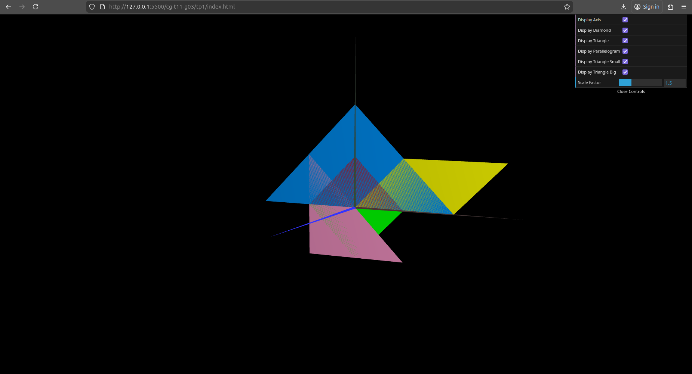

# CG 2025/2026

## Group T11G03

## TP 1 Notes

- In Exercise 1, we implemented `MyTriangle` and `MyParallelogram`. For the parallelogram to be double-sided, we duplicated the vertices and defined indices for both front (Counter-Clockwise) and back (Clockwise) faces. We also integrated checkboxes in the `dat.GUI` interface to control object visibility.
- In Exercise 2, we created `MyTriangleSmall` and `MyTriangleBig` by defining vertices relative to the origin to match the required dimensions. We updated `MyScene` to apply specific material colors (ambient, diffuse, specular) before displaying each object.

*Figure 1: Final result with all objects and GUI.*