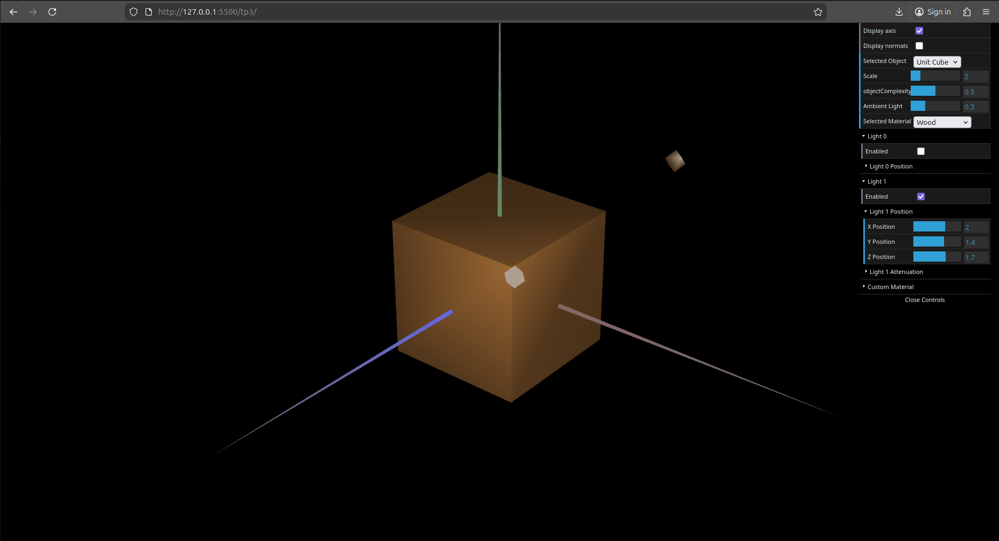
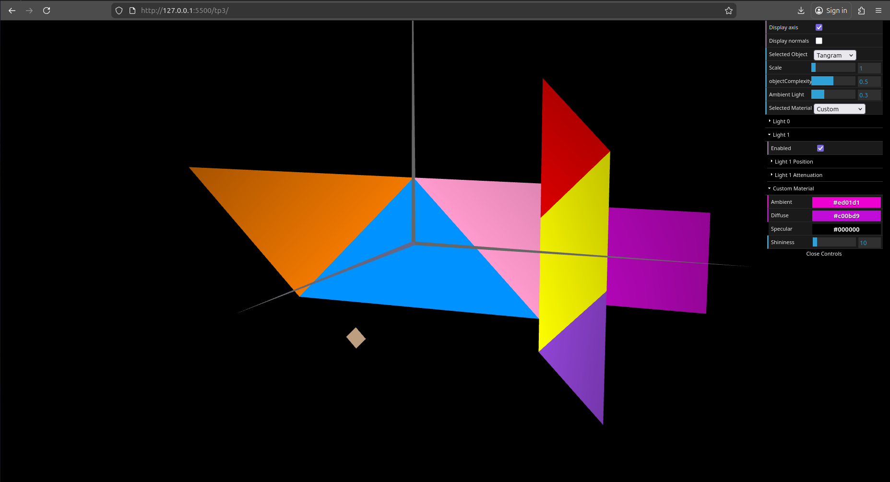
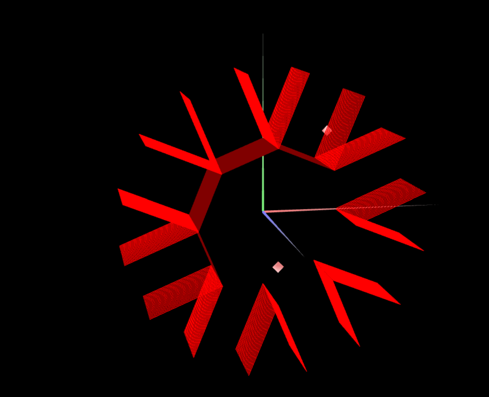
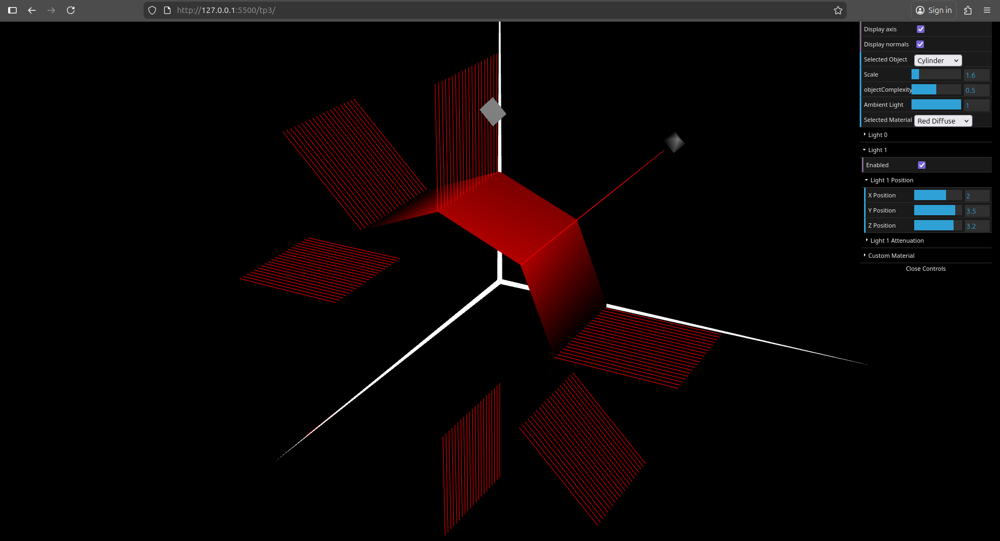

# CG 2025/2026

## Group T11G03

## TP 3 Notes

- In Part 1, we imported the Tangram and unit cube from TP2 into the new base project, added both to the selectable scene objects, and defined normals for the cube and Tangram pieces so lighting would behave correctly. We also created a wood-like material with low specular reflection and added it to the material list for testing on the cube.
- Still in Part 1, we updated `MyTangram` so each piece uses its own shiny material with colors matching the reference figure. The diamond was also adapted to use the scene's `Custom` material whenever that option is selected in the interface.
- In Part 2, we implemented `MyPrism` with configurable `slices` and `stacks`, generating the lateral faces of an open prism inscribed in a cylinder of radius 1 and height 1. The normals were defined per face, which produces the expected flat lighting transition between adjacent sides.
- In Part 3, we created `MyCylinder` from the prism implementation and replaced the face normals with radial normals perpendicular to the cylindrical surface. We also removed duplicated side vertices where possible so adjacent faces share vertices and the lighting transitions become smoother, giving the object a curved appearance.

*Figure 1: Exercise 4 of part 1 - unit cube with wood material applied.*

*Figure 2: Final result of part 1 - tangram with colors according to original image and custom diamond material.*

*Figure 3: Final result of part 2 - prism with several sides and several floors and its normals.*

*Figure 4: Final result of part 3 - cylinder with several sides and several floors and its normals.*
