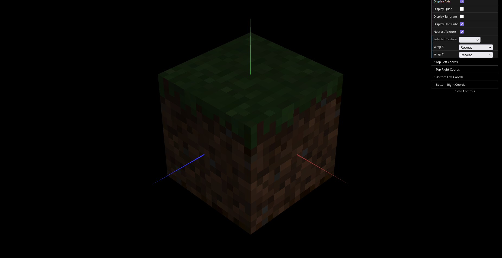

# CG 2025/2026

## Group T11G03

## TP 4 Notes

- We imported the Tangram and its piece classes into TP4, added a GUI option to hide the reference quad, created and applied a texture material with `images/tangram.png`, and defined the texture coordinates (`this.texCoords`) for each piece.
- For the second part, `MyUnitCubeQuad` was imported and changed to receive six `CGFtexture` objects as parameters for the cube faces, and now applies the textures with a GUI toggle to switch between nearest and linear filtering.

*Figure 1: Final textured Tangram with all pieces mapped to tangram.png.*

*Figure 2: Final textured UnitCubeQuad with the respective textures for each side.*
