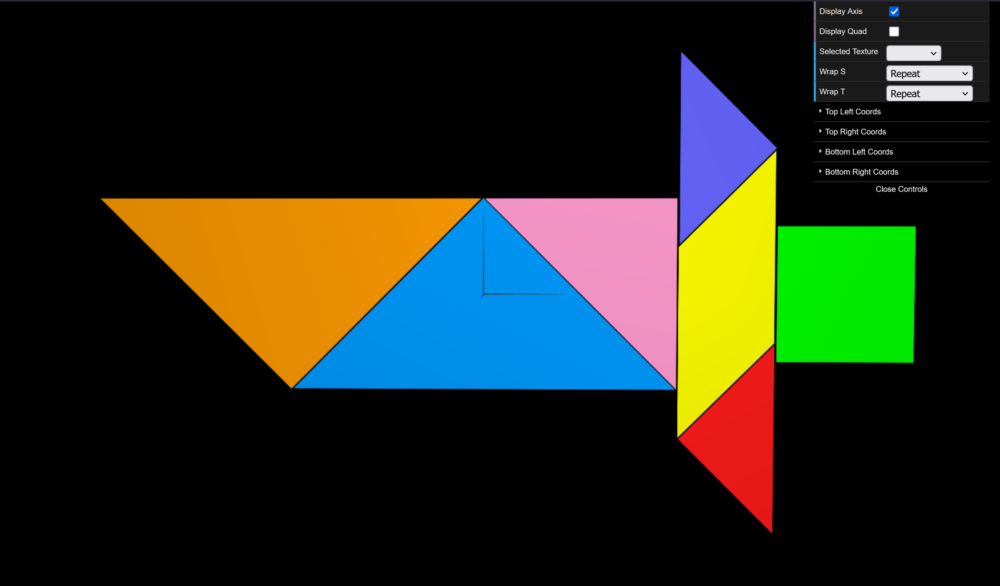

# CG 2025/2026

## Group T11G03

## TP 4 Notes

-We imported the Tangram and its piece classes into TP4, added a GUI option to hide the reference quad, created and applied a texture material with `images/tangram.png`, and defined the texture coordinates (`this.texCoords`) for each piece.

*Figure 1: Final textured Tangram with all pieces mapped to tangram.png.*
