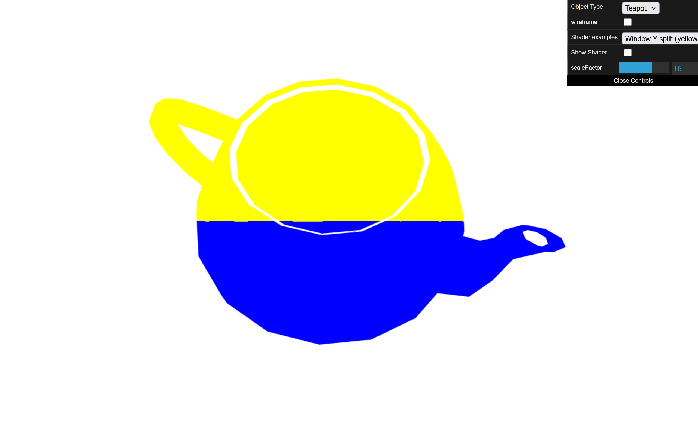
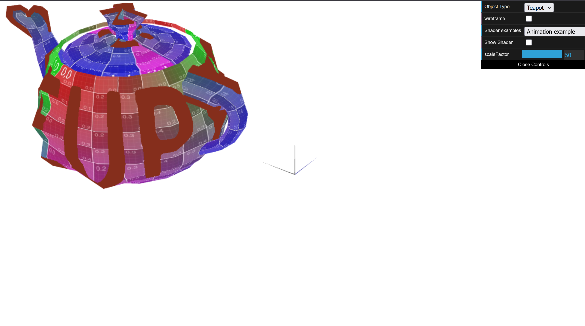
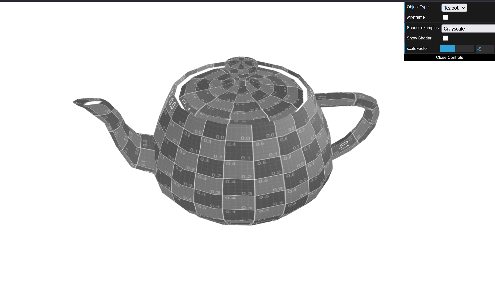

# CG 2025/2026

## Group T11G03

## TP 5 Notes

- For the first exercise, we created a custom shader pair for the teapot where the color depends on the fragment position in the window: yellow on the upper half and blue on the lower half. The vertex shader computes and passes the normalized screen-space Y coordinate to the fragment shader.

*Figure 1.*

- In the animation shader, we extended the existing effect by adding a sinusoidal translation on the X axis (`back and forth` movement), while keeping the previous normal-based displacement. The new translation amplitude depends on `scaleFactor` through `normScale`.

*Figure 2.*

- Based on the Sepia example, we created a new Grayscale fragment shader that converts each sampled color to luminance using `L = 0.299R + 0.587G + 0.114B`, then outputs `(L, L, L)`.

*Figure 3.*
